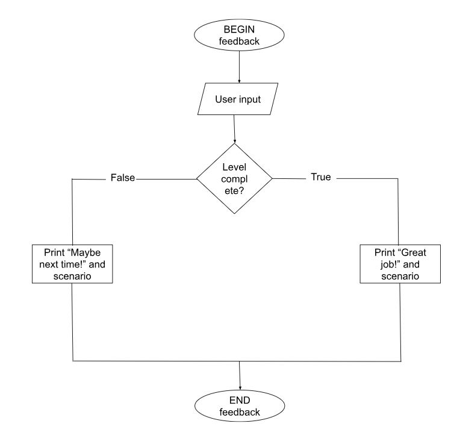

Portfolio

## Identifying and Defining:
### Identifying a need:
Game brainstorm 1:
- gives off magical vibes
- has story
- is about saving someone or something
e.g. cat on tree, village on fire
- kids can change main character
- has simple fighting abilities to defend the 'person-in-need-of-help'
- 2D

Game brainstorm 2:
- is something like mario mash up
- has coins that are to be obtainable
- the more coins you have at the end the higher your points are
- defeating monsters give you coins
- 2D

Game brainstorm 3:
- is like snake
- doesn't end until you die
- instead its a character that runs
- can eat powerups to achieve higher points
- 2D

Need: My game will provide a storyline where a hero saves people that are in need of help. Through playing my game children at the ages of 4 to 10 can obtain improvements in their hand-eye coordination because there is due to be simple fighting movements. Children can also improve their creativity thanks to the storyline which will also provide entertainment for the children.

Problem Statement: Children at the ages of 4 to 10 is a good time to develop or improve their skills, such as hand-eye coordination and  creativity. This can be accomplished through playing my game where a hero saves people in need of help. On the way there will be monsters that can be tackled through simple fighting. The 2D game will be made on a 2D Platformer and will provide amusing graphics for the children which will keep them entertained while improving their skills.

Skill Development: To make this game in Unity I will obtain help from the tutorial videos in the google classroom as well as Youtube and nearby advice.

### Requirements outline:
Inputs: 
In order to achieve moving the character, the user would have to use the arrow keys or WASD. Fighting would be possible by clicking on the mouse, the right click and left click will be different movements.

Processing:
The program for my game will check for collisions and will be regularly updated so that there is a minimum chance of bugs in the game. 

Outputs:
The game will display the character's position and certain messages, such as the game-over message, the aim of the round, etc. The game will also provide music that will calm the user while playing the game.

Transmission:
My game will not require network communication or multiplayer support.

Storage:
The game will store the game progress and user settings privately. If the user deletes the game then the progress will be lost.

### Functional requirements:
User interaction:
The user will interact with the character in the game by using keyboard controls and the mouse. Through this the user can move the character and fight the monsters and select options in the game. WASD and the arrow keys will be movement while mouse clicks will be fighting. 

Core gameplay or simulation mechanics:
The core actions of my game is fighting monsters. The monster would be either up high or down low and would be blocking the characters path. In order to get rid of the monster the user would have to either right click or left click to defeat it. Right click would be used to defeat monsters that are up high and left click would be used to defeat monsters that are down low. Different animations will be shown depending on the attack the character has done. 

Scoring and feedback:
My game will send feedback to the user when they have reached the end of the round. The message will be short and explain what the theme of the round was. For example, "Great Job! You saved Miss Petty's cat!". If the user has failed to reach the end of the round a message will be displayed as a comfort. For example, "It's ok, maybe next time you can save Miss Petty's cat!".

Level progression or simulation stages:
In my game there will be levels that can be accessed after the user presses the play button in the splash screen. A screen will pop up after pressing the button displaying the level numbers like bloxel rebound and fire-boy and water-girl. The levels will be numbered and can only be accomplised numerically. For example, if the user does not complete level 3 they cannot play level 4. When the user has finished a level they will be taken back to the screen with all of the level numbers.

Saving and loading data:
My game will save the game progress of the user and settings on the user's device. If the user deletes the game then the progress will be lost with it. 

### Non-functional requirements:
Performance requirements:
The game should load within a minute so that the user does not need to wait and response speed to the user inputs should be instant, without any lags in between. The inputs should be smooth and the interactions should also be instant.

Usability requirements:
My game will provide tutorials throughout the game to help the user have an easier time while playing the game. Although, if they do not want a tutorial there will be an option to skip the tutorial and get straight to the game so that the game doesn't keep the user waiting. The tutorial will be made so that it is easy to understand for my target market and other first-time users.

Compatibility requirements:
My game must be compatible with PC and web browsers, using mouse and keyboard controls in-game. My game will be hard to play on mobile due to needing arrow keys and a mouse to play it.

Scalability requirements:
My game should be able to have multiple levels without impacting the experience in the game. Although, there may be certain times of maintenance to add several levels just so that there is a smaller chance of users facing errors and lags while the game is updating.

Security requirements:
My game will keep private user data stored to ensure the privacy of users. High scores and personal settings will also be encrypted securely.

Reliability and availability:
The system should be accessible all the time without error unless the user does not have a secure network connection which will possibly lead to data loss.

### Social and Ethical Issues:
Meanings:
Equity: fairness and justice
Accessibility: the concept of whether a product or service can be used by everyone

Accessibility:
My game will be available and usable by people of all abilities due to it being simple and enjoyable. Even those of with disabilities, thanks to there being features such as alternative controls, visual adjustments and easy-to-understand tutorials. Thanks to these features, people of all ages and abilities will be able to access my game and play it with fun.

Privacy and Data Protection:
My project will collect user data, and before doing so the game will ask for the user for their consent. The personal information will be stored securely and safely. High scores and personal settings will be encrypted and stored safely. Once again this will all be done if the user gives the project consent to do so. 

Fariness and Representation:
My project avoids stereotypes and bias on gender, race and culture. At the start of the game, users will be able to select an avatar of their liking. The scenarios in the game will be diverse in order to reduce the chances of there being a misunderstanding of there being harmful stereotypes. This is so that everyone who will be playing my game can enjoy it to the fullest.

Mental and Emotional Well-Being:
My game could affect the users mental health by giving the user headaches. This is may be because of there being too much screen time on the game or becuase of the colours in the game affecting the eyes negatively. In order to try and stop this from occuring there will be a message before the splash screen warning the user of the consequences of playing this game too much or for too long.

Cultural Sensitivities:
There will be no content that could be offensive towards different cultures. No themes or symbols will be in the program that could be thought of as innappropriate or misunderstood from users of different cultural backgrounds. This is so that everyone, no matter the culture, can have fun by playing the game. 

## Researching and Planning
### PMI Table:

### Psuedocode and Flowchart:
